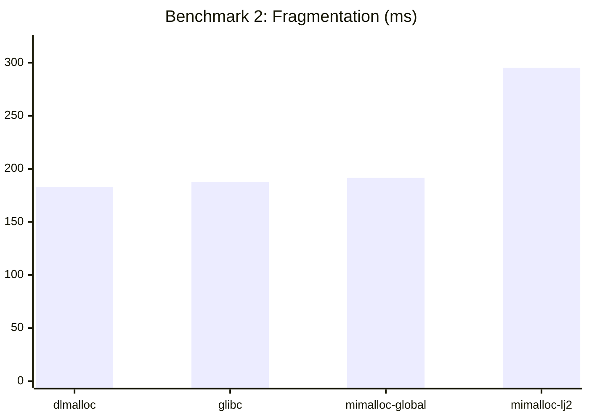
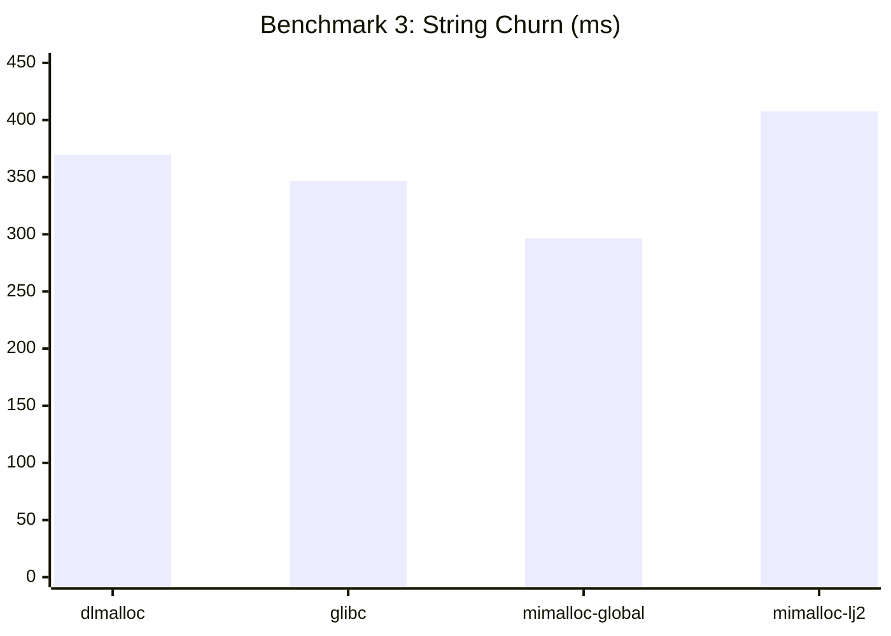
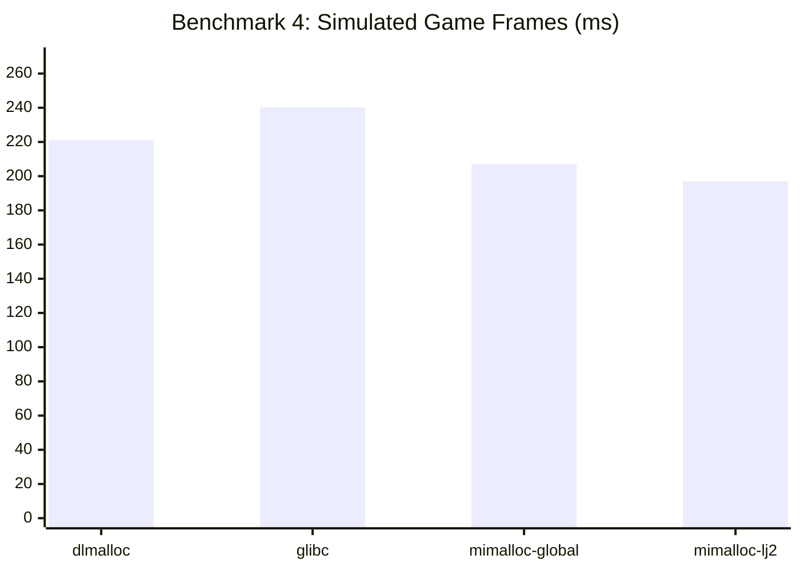
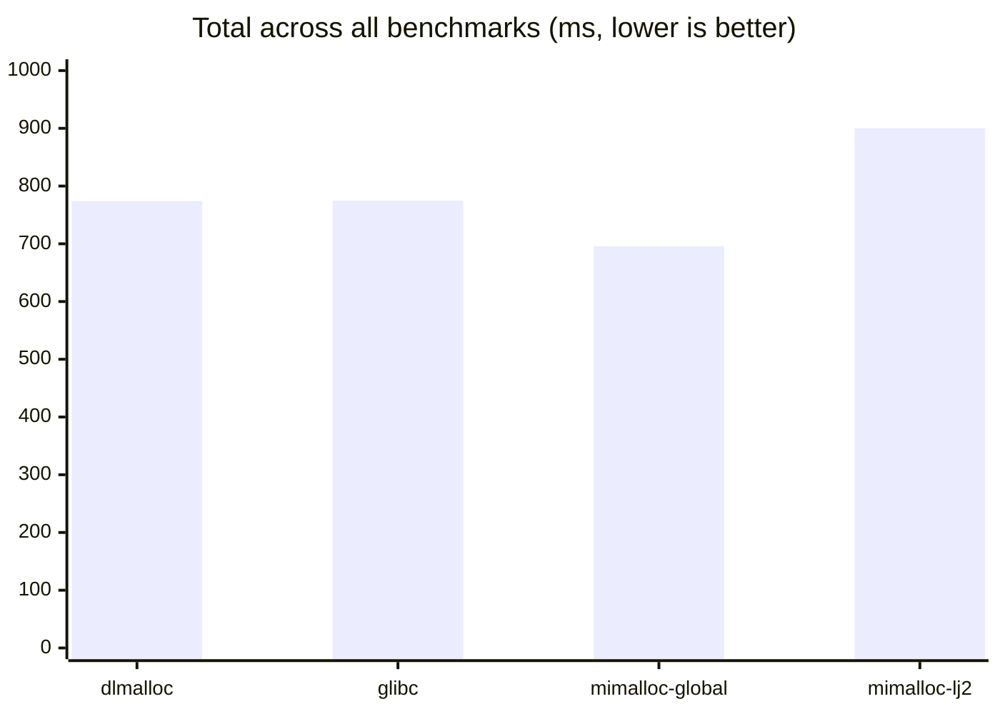

# Allocator Benchmark Results

The following is the result of attempting various benchmarks in OpenMW to determine the ideal memory allocation scenario.
We test four separate scenarios over 100 runs using the system allocator, glibc in this case, dlmalloc, LuaJIT's built-in, and two different methods of installing mimalloc -> application-wide, or, specifically embedded directly into LuaJIT.
All times are in seconds, lower is better.

## Configurations

| Label | Description |
|---|---|
| **dlmalloc** | Unmodified LuaJIT with its bundled dlmalloc. System glibc for everything else. |
| **glibc** | OpenMW profiler allocator active — LJ heap routed through system malloc/free. |
| **mimalloc-global** | `LD_PRELOAD=libmimalloc.so` — mimalloc intercepts malloc/free for the entire process. |
| **mimalloc-lj2** | Our new `lj_alloc.c` — mimalloc for LJ's heap only; rest of process uses glibc. |

---

## Averages (n=100)

| Benchmark | dlmalloc | glibc | mimalloc-global | mimalloc-lj2 |
|---|---:|---:|---:|---:|
| 1. Small ephemeral tables (2M) | 0.0005 s | 0.0005 s | 0.0005 s | 0.0005 s |
| 2. Fragmentation (fill/kill/refill 500K) | **0.1830 s** | 0.1876 s | 0.1915 s | 0.2952 s |
| 3. String churn (1M) | 0.3695 s | 0.3465 s | **0.2965 s** | 0.4075 s |
| 4. Simulated game frames (1000x200 events) | 0.2210 s | 0.2402 s | 0.2071 s | **0.1969 s** |
| **Total** | **0.7740 s** | **0.7748 s** | **0.6956 s** | **0.9001 s** |

---

## Charts

### Per-benchmark comparison (ms, lower is better)

---

## Analysis

### Benchmark 1 — Small ephemeral tables: No difference
All four allocators are identical at 0.0005 s. At this scale the JIT eliminates most
allocation overhead and the GC barely runs. Not a useful discriminator.

### Benchmark 2 — Fragmentation: dlmalloc wins, mimalloc-lj2 badly hurt
dlmalloc (0.183 s) edges out glibc (0.188 s) and mimalloc-global (0.192 s) — all within
noise. However mimalloc-lj2 (0.295 s) is **61% slower than dlmalloc**. This is the
split-heap penalty: LJ objects live in mimalloc's segments while OpenMW's objects remain
in glibc's heap. When the GC frees half the LJ tables non-contiguously, the two allocators'
free-list and segment bookkeeping structures fight over cache lines. Neither can coalesce
cleanly because its view of memory is incomplete.

### Benchmark 3 — String churn: mimalloc-global wins clearly
mimalloc-global (0.297 s) is **14% faster than glibc** and **20% faster than dlmalloc**.
String allocation involves many small, irregular-sized objects. mimalloc's size-class
segregation gives it better cache locality here — allocations of similar size land near
each other, so repeated accesses to newly-created strings hit warm cache lines. Again
mimalloc-lj2 (0.408 s) is the worst: string objects land in mimalloc's heap but the
interning hashtable and GC metadata live in glibc's heap, causing constant cross-heap
pointer chasing.

### Benchmark 4 — Simulated game frames: both mimalloc variants win
This is the most realistic scenario. mimalloc-lj2 (0.197 s) narrowly beats
mimalloc-global (0.207 s), both comfortably ahead of dlmalloc (0.221 s, +12%) and
glibc (0.240 s, +22%). The mixed-lifetime pattern (short-lived event tables, long-lived
entity state, periodic GC) is where mimalloc's per-size-class segregated free lists pay
off regardless of the split-heap overhead. Notably this is the benchmark where
mimalloc-lj2 recovers — LJ object lifetimes dominate this workload, so having mimalloc
manage just the LJ heap is sufficient to win.

---

## Key Takeaways

**mimalloc-global is the best overall choice** (695 ms total, -10% vs dlmalloc,
-10% vs glibc). The LD_PRELOAD approach covers the whole process, eliminating the
split-heap cache penalty while delivering mimalloc's allocation advantages everywhere.

**mimalloc-lj2 is the worst overall** (900 ms total, +16% vs dlmalloc). Having mimalloc
manage only LJ's heap while glibc manages everything else creates more cross-heap pointer
chasing than either single-allocator setup. It only wins in the game-frame scenario
where LJ objects dominate. The fragmentation and string benchmarks are significantly hurt.

**dlmalloc and glibc are near-identical overall** (774 ms each). dlmalloc's tuning for
Lua's allocation patterns gives it a fragmentation edge; glibc wins on strings. They
trade blows.

**Recommendation:** For benchmarking OpenMW with improved allocation, use
`LD_PRELOAD=mimalloc/build/libmimalloc.so` with the profiler enabled. This gives the
most consistent improvement across all workload types and avoids the split-heap
pathology of the LJ2-only configuration.
